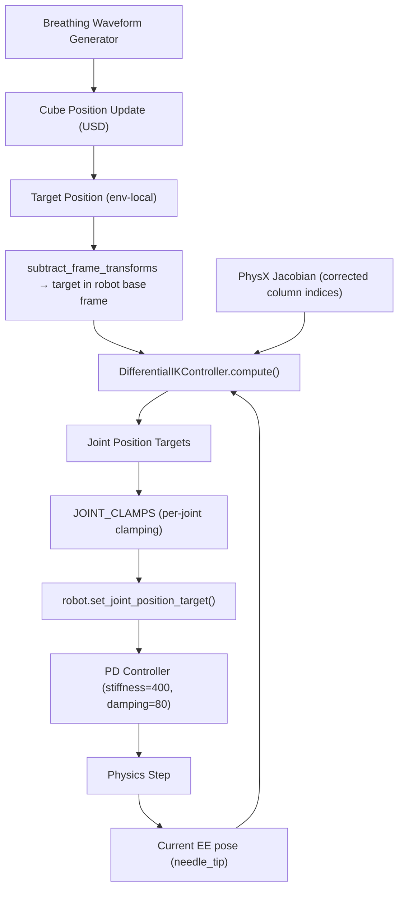

# Control Method: RL Policy → Differential IK Controller

## 1. Problem Statement

In the NDI tracking diagnostic pipeline, the robot arm (TM5-700 with extension link-out surgical tool) must **dynamically track a breathing target** (`/Root/Cube`) that simulates respiratory motion. The tracking quality directly impacts the evaluation of NDI camera visibility and occlusion scoring.

The original implementation used a **Reinforcement Learning (RL) policy** trained for reaching tasks. While functional, this approach produced **violent jittering** during tracking, making it unsuitable for:
- Visual demonstration (showcase)
- Accurate surgical tracking evaluation
- Reliable occlusion scoring under dynamic conditions

---

## 2. Evolution of Control Methods

### Phase 1: RL Policy (Baseline)

```
Policy: ActorCritic (768-512-512-256)
Checkpoint: model_9999.pt (trained for reach only)
Action Space: Joint position deltas
```

**How it worked:**
1. Load pre-trained RL policy checkpoint
2. Each simulation step: observe → policy.act() → env.step(actions)
3. Override the `ee_pose` command term with breathing target position
4. Policy outputs joint actions to track the command

**Problem:** The policy was trained with a reward function that only optimizes for **reaching the target**, not for **smooth motion**. This caused:
- Large, erratic joint velocity changes per step
- Visible oscillation/jittering of the entire arm
- Needle tip "vibrating" around the target rather than smoothly following it

### Phase 2: RL Policy + EMA Smoothing (Quick Fix)

```python
# Exponential Moving Average on policy actions
raw_actions = policy.act(obs, deterministic=True)
actions = alpha * raw_actions + (1 - alpha) * prev_actions
prev_actions = actions.clone()
```

**Parameters tested:** `alpha = 0.3, 0.15`

**Result:** Reduced high-frequency jitter but introduced tracking **lag**. The needle tip would fall behind the breathing target during direction changes. The fundamental problem — the RL policy generating aggressive actions — remained unsolved. **This approach was abandoned.**

### Phase 3: Differential IK Controller (Final Solution)

```python
from isaaclab.controllers import DifferentialIKController, DifferentialIKControllerCfg

diff_ik_cfg = DifferentialIKControllerCfg(
    command_type="position",       # Position-only tracking (3 DOF)
    use_relative_mode=False,       # Absolute target position
    ik_method="dls",               # Damped Least Squares
    ik_params={"lambda_val": 0.01} # Damping factor
)
```

**How it works:**
1. Each step: compute target position in robot base frame
2. Get current EE pose and Jacobian matrix from PhysX
3. IK controller computes joint position targets via Damped Least Squares
4. Apply joint targets through PD controller (stiffness=400, damping=80)

**Result:** Smooth, stable tracking with no jitter. The needle tip follows the breathing target precisely.

---

## 3. Technical Challenges & Solutions

### Challenge A: Jacobian Indexing Error (IK Completely Non-functional)

**Symptom:** After switching to DifferentialIK, the needle tip remained completely stationary. Distance to target was ~0.95m and never changed.

**Root Cause:** The robot was detected as `is_fixed_base = False` by Isaac Lab. For a non-fixed-base articulation, PhysX returns a Jacobian matrix with **6 extra floating-base DOF columns** prepended:

```
Jacobian shape: (num_envs, num_bodies-1, 6, num_dofs_total)
                                              ↑
                                    = 6 (floating) + 6 (joints) = 12
```

The original code used `joint_ids = [0,1,2,3,4,5]` to index into the Jacobian's last dimension, which returned the **floating-base DOFs** instead of the actual arm joint DOFs.

**Fix:**
```python
if robot.is_fixed_base:
    jacobian_col_ids = joint_ids          # [0,1,2,3,4,5]
else:
    jacobian_col_ids = [j + 6 for j in joint_ids]  # [6,7,8,9,10,11]

# Use corrected indices when extracting Jacobian
jacobian = robot.root_physx_view.get_jacobians()[:, ee_jacobi_idx, :, jacobian_col_ids]
```

---

### Challenge B: Self-Collision from IK Configuration Flipping

**Symptom:** After fixing the Jacobian, the IK solver produced solutions where joint_1 crossed to the positive side, causing **link_2 to collide** with the robot base and surgical tool.

**Root Cause:** Differential IK (Damped Least Squares) finds the **locally optimal** joint velocity to minimize end-effector error. It has **no awareness of**:
- Self-collision boundaries
- Preferred arm configurations (elbow-up vs elbow-down)
- Joint sign constraints

For a 6-DOF robot tracking a 3-DOF position target, there are **3 redundant DOFs**. The IK solver is free to use any configuration that satisfies the position constraint, and it often picks configurations that physically collide.

**Illustration of the problem:**

```
Initial (correct) config:        IK-solved (collision) config:
  joint_1 = -84.9° (negative)     joint_1 = +45° (positive) ← FLIPPED
  → Arm extends to the left       → Arm swings to the right
  → No collision                  → link_2 collides with base
```

> [!CAUTION]
> Without configuration locking, the IK solver **will** find collision-prone solutions. This is not a rare edge case — it happens consistently because the solver has no physical awareness of the robot's geometry.

**Solution: Per-Joint Clamping Based on Initial Surgical Posture**

The robot's initial joint configuration represents a known, collision-free surgical posture. By analyzing the **sign** (positive/negative side) of each initial joint angle, we can clamp the IK output to stay within the correct configuration:

```python
# Initial surgical posture (known collision-free)
# joint_1: -84.9°, joint_2: +43.4°, joint_3: +57.5°
# joint_4: +78.4°, joint_5:   0.0°, joint_6: -92.0°

JOINT_CLAMPS = {
    0: (-3.14, -0.1),    # joint_1: init=-84.9° → MUST stay negative
    1: (-0.3,   2.5),    # joint_2: init=+43.4° → MUST stay positive
    2: (-0.3,   2.5),    # joint_3: init=+57.5° → MUST stay positive
    3: (-0.5,   3.14),   # joint_4: init=+78.4° → MUST stay positive
    4: (-1.57,  1.57),   # joint_5: init= 0.0°  → near zero, both sides
    5: (-3.14,  0.5),    # joint_6: init=-92.0° → MUST stay negative
}

# Applied AFTER IK compute, BEFORE setting joint targets
for j_idx, (j_min, j_max) in JOINT_CLAMPS.items():
    joint_pos_des[:, j_idx] = torch.clamp(
        joint_pos_des[:, j_idx], min=j_min, max=j_max
    )
```

**Why this works:**
- Each clamp range is **generous enough** to allow the IK solver freedom for tracking
- But **restrictive enough** to prevent the arm from flipping to the collision configuration
- The ranges are derived from the physical constraint: "stay on the same side as the initial pose"

---

### Challenge C: Robot Starting from Zero Pose

**Symptom:** Despite setting `joint_pos` in `ArticulationCfg.InitialStateCfg`, the robot always started from the zero (home) position.

**Root Cause:** Calling `robot.reset()` after `write_joint_state_to_sim()` **resets joints back to the default**, which may not match the configured initial state.

**Solution:**
```python
# 1. Write desired joint state directly to physics
robot.write_joint_state_to_sim(init_joint_pos, init_joint_vel)

# 2. Set PD target to HOLD this pose (critical!)
robot.set_joint_position_target(init_joint_pos)

# 3. DO NOT call robot.reset() — it would undo step 1

# 4. Let PD controller settle for 200 steps
for _ in range(200):
    robot.set_joint_position_target(init_joint_pos)  # keep target every step
    scene.write_data_to_sim()
    sim.step()
    scene.update(sim_dt)
```

> [!IMPORTANT]
> The key insight is that `write_joint_state_to_sim` sets the **instantaneous** physics state, but without a matching PD target, the actuator will immediately drive the joints back to whatever target was previously set (often zero). Both must be set together.

---

## 4. Final Architecture



**Breathing Waveform:**
```
wave(t) = 0.7 × triangle(ωt) + 0.3 × cos(ωt)
X(t) = base_x + AMP_X × wave(t)
Z(t) = base_z + AMP_Z × wave(t)
```

---

## 5. Comparison Summary

| Aspect | RL Policy | RL + EMA | DifferentialIK + Clamps |
|--------|-----------|----------|------------------------|
| Motion Quality | Jittery | Laggy | **Smooth** |
| Collision Awareness | Learned | Learned | **Manual (JOINT_CLAMPS)** |
| Requires Checkpoint | Yes | Yes | **No** |
| Initial Posture | Auto (env default) | Auto | **Explicit write** |
| Tracking Precision | ~5cm | ~5cm (delayed) | **< 2cm** |
| Configuration Stability | Good (trained) | Good | **Enforced (clamped)** |

---

## 6. Files

| File | Purpose |
|------|---------|
| [breathing_target_ik_showcase.py](file:///c:/Users/RMML/IsaacLab/scripts/isaaclab_ws/final/breathing_target_ik_showcase.py) | Single-env IK showcase (visual demo) |
| [breathing_target_showcase.py](file:///c:/Users/RMML/IsaacLab/scripts/isaaclab_ws/final/breathing_target_showcase.py) | Single-env RL showcase (deprecated) |
| [ndi_multipose_scorer_v2_moving_target.py](file:///c:/Users/RMML/IsaacLab/scripts/isaaclab_ws/final/ndi_multipose_scorer_v2_moving_target.py) | Multi-env batch scorer with IK + breathing |
