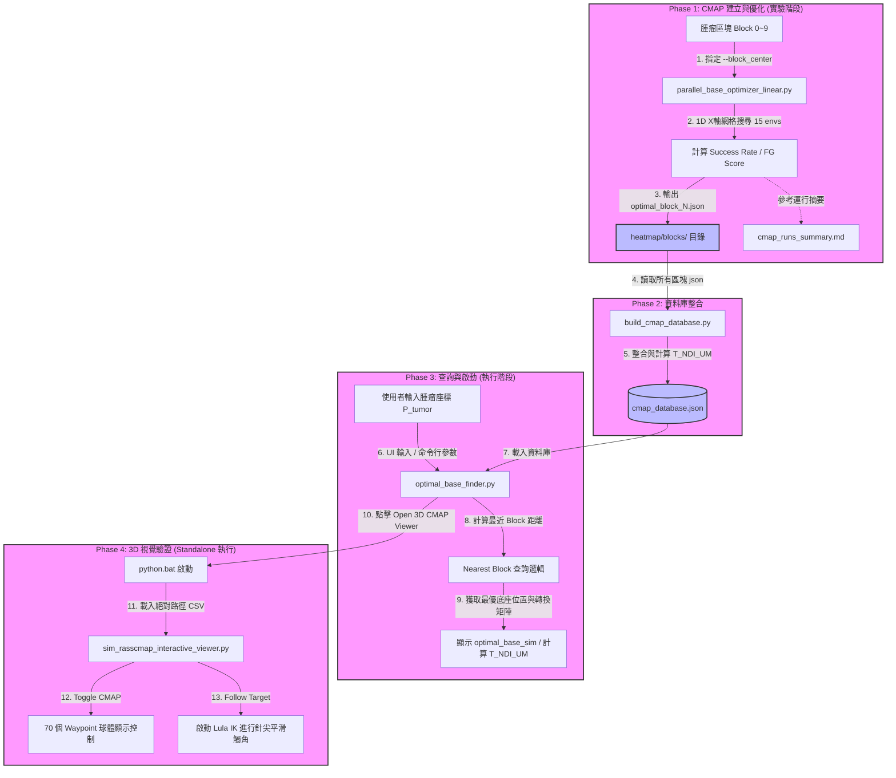

# 系統設計與架構規範 (System Design & Architecture Specs)

本文件整合了 RASSCMAP 協同模擬系統的**核心目標**、**系統架構**、**完整數據流**、**座標轉換關係**、**資料庫結構**，以及**所有已開發指令與腳本的對照清單**。

---

## 1. 核心目標 (Core Objectives)

本系統的核心目標在於：**「以患者體內的腫瘤位置為輸入，自動查詢並計算出最佳的機器人底座位置（Robot Base Pose），並在 Isaac Sim 3D 虛擬環境中提供視覺化網格（CMAP）與 Lula IK 機械手臂針尖（needle_tip）精準觸及驗證。」**

系統具備四個主要發展階段：
1. **優化搜尋（Phase 1）**：在 Isaac Lab 中進行大規模並行物理模擬搜尋，建立各個腫瘤區塊（Block）的 CMAP。
2. **資料庫彙整（Phase 2）**：彙整所有區塊的最優底座與可達性數據，並預先計算光學定位系統（NDI）與機器人 Marker（UM）之間的空間變換。
3. **查詢啟動（Phase 3）**：在 Conda 環境中透過直觀的 Tkinter GUI 提供座標查詢，動態計算 NDI 座標引導。
4. **虛擬 Replay 驗證（Phase 4）**：在 Isaac Sim Standalone 中展示平滑的底座滑動動畫，並藉由 Lula 求解器完成高精度追蹤。

---

## 2. 系統架構與整體數據流 (System Architecture & Data Flow)

系統整體流程包含從離線實驗階段至即時臨床導航驗證階段的數據流動：



### 數據流說明：
1. **CMAP 建立與優化**：對於每個腫瘤區塊（Block 0~9），執行並行優化器搜尋 X 軸網格上 15 個底座位置的成功率，並將每次搜尋的原始參數記錄於 `cmap_runs_summary.md`（包含可達性指標與運算設定）。
2. **資料庫生成**：`build_cmap_database.py` 將各區塊的優化 JSON 與對應的 CSV 檔彙整，計算好對應 NDI 座標系的轉換矩陣，輸出為 `cmap_database.json`。
3. **查詢 UI**：使用者於 GUI 介面輸入腫瘤座標，系統查詢最優底座並以毫米（mm）顯示定位變換矩陣。
4. **獨立驗證執行**：點選按鈕後，啟動器會以絕對路徑方式呼叫 Isaac Sim 獨立環境的 `python.bat`，拉起 3D Replay Viewer。

---

## 3. 座標系統與空間轉換 (Coordinate Systems & Transformations)

### 3.1 座標系定義 (Frames)

| 座標系 | 說明 |
| :--- | :--- |
| **World** | Isaac Sim 世界座標系，以層級中的 `/Root` 作為原點。 |
| **robotarm_base** | 機器人底座坐標系，即 `/Root/robotarm_base/robotarm_base/tm5_700`。 |
| **UM** | `/Root/robotarm_base/robotarm_base/UM`，機器人底座上安裝的 NDI 被動反光標記點。 |
| **NDI** | `/Root/NDI`，代表現實手術室中 NDI 光學追蹤系統的相機坐標系。 |

### 3.2 空間矩陣變換關係 (Transform Derivation)

手術導航系統需要知道機器人 UM 標記在 NDI 追蹤器下的相對坐標，計算公式如下：

$$T_{NDI\_UM} = T_{World\_NDI}^{-1} \cdot T_{World\_UM}$$

其中：
*   $T_{World\_NDI}$：NDI 追蹤器在世界坐標系下的 4×4 齊次矩陣（在 USD 中為固定變換）。
*   $T_{World\_UM}$：由 USD 讀取的 UM 標記在當前底座位置下的 4×4 齊次世界變換矩陣。
*   平移矩陣的輸出單位在 UI 顯示時應自動乘以 `1000.0` 轉換為**毫米（mm）**，以符合手術導航系統的習慣。

### 3.3 核心坐標獲取程式碼 (USD Transform API)
```python
import numpy as np
from pxr import UsdGeom, Gf

def get_prim_world_matrix(stage, prim_path: str) -> np.ndarray:
    """讀取 USD Prim 的 local-to-world 4x4 矩陣，並轉換為 numpy conventions。"""
    prim = stage.GetPrimAtPath(prim_path)
    if not prim.IsValid():
        raise ValueError(f"Prim not found: {prim_path}")
    xformable = UsdGeom.Xformable(prim)
    gf_mat = xformable.ComputeLocalToWorldTransform(0.0) # Column-major
    
    # 轉換為 Row-major numpy 矩陣
    T = np.array([
        [gf_mat[0][0], gf_mat[1][0], gf_mat[2][0], gf_mat[3][0]],
        [gf_mat[0][1], gf_mat[1][1], gf_mat[2][1], gf_mat[3][1]],
        [gf_mat[0][2], gf_mat[1][2], gf_mat[2][2], gf_mat[3][2]],
        [gf_mat[0][3], gf_mat[1][3], gf_mat[2][3], gf_mat[3][3]],
    ], dtype=np.float64)
    return T
```

---

## 4. 資料庫結構規範 (Database Schema)

`cmap_database.json` 包含系統中所有腫瘤區塊的優化成果，結構如下：

```json
{
  "metadata": {
    "created": "2026-05-20T10:00:00Z",
    "num_blocks": 10,
    "T_World_NDI": [
      [1.0, 0.0, 0.0, 0.0],
      [0.0, 1.0, 0.0, 0.0],
      [0.0, 0.0, 1.0, 0.0],
      [0.0, 0.0, 0.0, 1.0]
    ]
  },
  "blocks": [
    {
      "block_id": 0,
      "block_center": [0.1, 0.0, 0.0],
      "wp_bounds": {
        "x_min": -0.12, "x_max": 0.35,
        "y_min": -0.28, "y_max": 0.28,
        "z_min": 0.85, "z_max": 1.35
      },
      "optimal_base": {
        "base_x": 0.45,
        "base_y": 0.0,
        "fg_score": 3.12e-120,
        "success_rate": 0.91,
        "sr_min": 1
      },
      "T_NDI_UM": [
        [1.0, 0.0, 0.0, 31.5],
        [0.0, 1.0, 0.0, -506.0],
        [0.0, 0.0, 1.0, 919.4],
        [0.0, 0.0, 0.0, 1.0]
      ],
      "backup_csv": "heatmap/blocks/backup_live_block0_20260521_032119.csv",
      "opt_csv": "heatmap/blocks/optimization_results_block0_20260521_032119.csv"
    }
  ]
}
```

---

## 5. 優化演算法與評估指標 (Optimization Cost Function)

底座優化的評估核心在於保證**最基本可達性**的同時，最大化關節靈巧度（Dexterity）。

### 5.1 綜合指標評分公式 (Cost Function Formula)

底座位置的分數 $f_g$（細粒度評分 `fg_score`）定義如下：

$$f_g = \min(S_r) \cdot \prod_k c(t,k) \cdot c_s$$

各項物理意義與 CSV 對應關係如下表：

| 符號 | CSV 欄位名稱 | 物理與演算法意義 |
| :--- | :--- | :--- |
| $\min(S_r)$ | `sr_min` | **邊界安全鎖**。若該底座能讓 70 個 Waypoints 皆至少有一種姿態可達，則為 1；若有任一 Waypoint 完全不可達，則為 0。 |
| $\prod_k c(t,k)$ | `prod_c` | **空間靈巧度乘積**。70 個 Waypoints 在該底座位置下的平均可達操作度（AMI）之乘積，用於獎勵高靈巧度區域。 |
| $c_s$ | `success_rate` | **綜合成功率**。所有（Waypoint × 姿態）測試對中，IK 求解成功的比例。 |
| $f_g$ | `fg_score` | **最終細粒度得分**。數值越高，代表該底座位置的綜合可達與操作性能越優秀。 |

---

## 6. 已開發檔案與執行指令對照表 (Files, Functions & Commands Reference)

本系統涵蓋 **Isaac Lab 實驗端**與 **Isaac Sim 獨立運行端** 兩個主要工作空間。

### 6.1 Isaac Lab 工作空間 (路徑: `C:\Users\RMML\IsaacLab`)
此工作空間運行於 conda 環境 `env_isaaclab` 下，主要負責批量平行優化、資料庫彙整與 Tkinter 查詢介面。

| 檔案路徑與名稱 | 主要功能說明 | 執行環境與指令 | 關鍵參數說明 |
| :--- | :--- | :--- | :--- |
| `scripts\isaaclab_ws\reachability_map\parallel_base_optimizer.py` | 2D 網格底座優化搜尋（離線計算）。計算各底座位置對 70 個路徑點的 RI、AMI 等指標。 | `.\isaaclab.bat -p scripts\...\parallel_base_optimizer.py` | `--max_waypoints 70`<br>`--pos_threshold 0.0015` |
| `scripts\isaaclab_ws\reachability_map\parallel_base_optimizer_linear.py` | 1D X軸網格底座優化搜尋（固定 Y=0.0，共 15 個並行 envs），針對給定的 `--block_center` 與 `--block_id` 計算優化 JSON 檔。 | `.\isaaclab.bat -p scripts\...\parallel_base_optimizer_linear.py` | `--block_center X Y Z`<br>`--block_id N` |
| `scripts\isaaclab_ws\reachability_map\build_cmap_database.py` | 遍歷並整合 `heatmap/blocks/` 下所有 `optimal_block_N.json` 檔案，在 NDI 架構下計算 $T_{NDI\_UM}$ 矩陣，導出最終整合資料庫。 | `python scripts\...\build_cmap_database.py` | `--block_dir <dir>` |
| `scripts\isaaclab_ws\reachability_map\optimal_base_finder.py` | 基於 Tkinter 製作的查詢 GUI。提供使用者輸入腫瘤座標，即時查詢最近區塊並顯示 NDI 定位資訊，並透過 "Open 3D CMAP Viewer" 按鈕自動背景執行 `python.bat` 拉起 Isaac Sim。 | `python scripts\...\optimal_base_finder.py` (執行前需先 activate `env_isaaclab`) | (無，主要透過 Tk 視覺介面輸入座標) |
| `scripts\isaaclab_ws\reachability_map\update_optimal_jsons.py` | 批次修正腳本。重新解析原始 CSV 並調整排序邏輯，將成功率（cs）作為第一優先級，提升最優底座的實際可靠性。 | `python scripts\...\update_optimal_jsons.py` | (無，自動遍歷 10 個 blocks) |
| `scripts\isaaclab_ws\reachability_map\generate_task_waypoints.py` | （已棄用）以數學公式在腫瘤周圍生成 10×7 個半球形導航點。目前已改由直接在 USD 場景中讀取手動標註的 70 個 Waypoints。 | `.\isaaclab.bat -p scripts\...\generate_task_waypoints.py` | `--num_envs 1` |

### 6.2 Isaac Sim Standalone 工作空間 (路徑: `C:\Users\RMML\AppData\Local\ov\pkg\4.5.0`)
此工作空間直接運行於 Isaac Sim 內置環境下（透過 `python.bat` 啟動），用於 high-fidelity 視覺化及 Lula IK 手臂軌跡驗證，不相依於 Isaac Lab 龐大的模組包。

| 檔案路徑與名稱 | 主要功能說明 | 執行環境與指令 | 關鍵參數說明 |
| :--- | :--- | :--- | :--- |
| `standalone_ws\rasscmap\sim_rasscmap_interactive_viewer.py` | Standalone Replay 查看器。包含 `omni.ui` 切換按鈕、CMAP Overlay 球體繪製、高亮最近點、底座 Sine 平滑滑行、Lula IK 針尖均速 Ease-In-Out 連續對焦。 | `python.bat standalone_ws\rasscmap\sim_rasscmap_interactive_viewer.py` | `--backup_csv <path>`<br>`--opt_csv <path>`<br>`--tumor_pos X Y Z`<br>`--headless` |
| `standalone_ws\rasscmap\optimal_base_finder_sim.py` | Standalone 下的命令列查詢工具，用於無 GUI 狀態下檢索最優底座並一鍵拉起 3D Replay Viewer。 | `python.bat standalone_ws\rasscmap\optimal_base_finder_sim.py` | `--tumor_pos X Y Z`<br>`--launch` |
| `standalone_ws\rasscmap\README.md` | 提供獨立工作空間的典型啟動指令與模組邊界說明文件。 | （文件檔） | — |
| `standalone_ws\rasscmap\MIGRATION_RECORD.md` | 移植說明文件，詳細列出哪些組件被完全移植，哪些組件被重構，以及 Standalone 的開發邊界。 | （文件檔） | — |

---

*本文件為系統架構的最終規範。開發、Bug 修復與 Replay 驗證記錄請參考隨附的 [development_verification_record.md](file:///C:/Users/RMML/IsaacLab/scripts/isaaclab_ws/reachability_map/development_verification_record.md)。*
