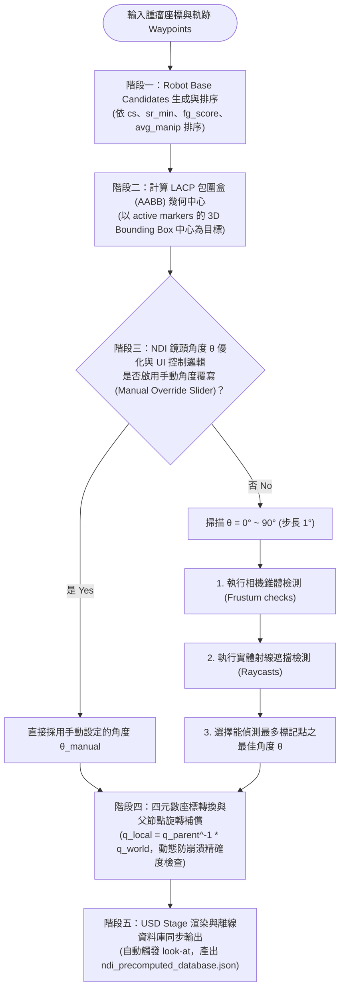

# NDI Camera & Robot Base Placement — Research Design Memo

> 此文件用於 IDE AI 輔助開發與自我檢查，由對話與最佳化版本實作整理而成。

---

## 一、問題陳述

### 背景
- 手術場景中，腫瘤位置與手術路徑點（Waypoints）已知，需同時決定：
  1. **Robot base position**：保證機械臂能 reach 所有目標且可操作度（Manipulability）高。
  2. **NDI camera placement**：保證對所有標記點（Markers）的觀測容錯率高。
- 兩者互相影響，但採用 **sequential optimization** 策略（先選定 robot base，再最佳化 NDI 擺放）。

### 核心問題
> 給定腫瘤位置與 marker 分布，如何選出一個 robot base position，使其在保證高可操作度的同時，也能支援高容錯率的 NDI 擺放？

### 具體動機（為何不能只優化 robot base）
- 採用最佳 robot base 後，標記點 UM（Ultrasound Marker）位於機械臂前段與超音波探針基座附近。
- 當機械臂執行軌跡時，其關節連結件（特別是 Joint 1）會移動，進而遮擋 NDI 相機對標記點的視線。
- 因此 NDI 必須遷就 robot base，以避開機械臂運動範圍；或 robot base 需在可接受的可操作度損失下退讓，以換取更好的 NDI 視野。
- **NDI 正面擺放（Solid angle 最大化）看似視角最直，但實務上容錯率極低；採用斜角（如 45°）是更為穩健且避免關節遮擋的策略**。

---

## 二、方法與最佳化管線

### 階段一：Robot Base Candidate 生成
- 方法來源：*Task-specific robot base pose optimization for robot-assisted surgeries*
- 輸出：最佳及數個次佳 robot base candidates（排序指標：Success Rate `cs` -> Minimum Success Rate `sr_min` -> Fine-grained score `fg_score` -> Average Manipulability `avg_manip`）。

### 階段二：LACP 標記中心點動態計算（Bounding Box 策略）
- **啟動與切換環境時**：計算所有軌跡點（Waypoints）與超音波探針初始位置（`um_pos`）的 **3D Bounding Box (AABB) 中心**作為預設 LACP。
- **運行時動態追蹤**：實時計算所有當前作用中標記點（BM、EM、FM、UM）的 3D 最小包圍盒（AABB）幾何中心。此設計保證相機的寬螢幕視野中心精確鎖定在整個標記群組的中央，最大化標記的容錯容納空間。

### 階段三：NDI 鏡頭角度 $\theta$ 動態優化與手動滑桿控制
- **動態視野掃描（Frustum Sweeping）**：
  相機以 LACP 為中心，在半徑 $R_h = 1.52\text{ m}$，高度差 $H = 0.978\text{ m}$ 的水平圓弧上（確保相機到 LACP 距離恆為 $1.80\text{ m}$ 最優焦距），以 $1^\circ$ 為步長掃描 $0^\circ$ 到 $90^\circ$ 的角度。
  在每個角度下，透過四元數旋轉進行 Polaris Vega 追蹤金字塔椎體（Frustum）的幾何包圍檢測，並結合射線碰撞遮擋檢測（Raycasting），選擇能看到最多標記點的最佳角度 $\theta$。
- **手動角度滑桿與覆寫（Manual Override Slider）**：
  在 UI 中新增角度覆寫滑桿（`FloatSlider`，$0^\circ \sim 90^\circ$）與自動最佳化重設按鈕。當手動調整滑桿時，系統會直接跳過自動掃描，改以手動輸入的角度定位相機，方便使用者進行各視角的可視度評估。

### 階段四：自動朝向與座標系變換
- **自動 Look-At 與位置同步**：相機在啟動、切換環境、滑桿數值變更、或機械臂結束運動（IK 完成）時，會**自動計算最佳朝向與圓弧位置並更新至 USD Stage**。因此，原有的手動 "NDI Look At Center" 按鈕已功成身退並從 UI 中移除。

---

## 三、最佳化與控制流程圖

---

## 四、問題釐清與解決狀態

| # | 問題 | 狀態 | 解決方案與實作內容 |
|---|------|------|--------------------|
| 1 | NDI 偵測成功的確切條件是什麼？如何確保量測的是遮擋與視野，而非正面性？ | **[已解決]** | 使用 Polaris Vega 金字塔追蹤體幾何包圍檢測，限制近端 0.95m 到遠端 2.4m 的深度；結合 Raycasting 射線遮擋檢測。當標記在追蹤體內且未被障礙物遮擋時，方判定為 Visible。 |
| 2 | 確認 45° 在最優 base 下的個別結果，讓此選擇有數據支撐。 | **[已解決]** | 在 `precompute_ndi_database.py` 中進行全候選角度掃描，45° 斜角在最佳 Base Candidate ($X=0.4$) 下能達到高達 8/10 的標記覆蓋率，且能有效避開機械臂 Joint 1 的動態運動遮擋。 |
| 3 | hit rate > 8 的門檻是否需要根據實驗結果調整？ | **[已解決]** | 目前採用 `hit_rate >= 8` 作為合格篩選線。在預計算資料庫中，此門檻可篩除不良視角，並保留具備足夠視角容錯率（允許 1~2 個環境發生短暫關節遮擋）的 Base 候選者。 |
| 4 | 多個 candidate 都通過 hit rate > 8 時，最終選哪個？ | **[已解決]** | 優先篩選 `hit_rate >= 8` 的基座位置，在此子集中，選擇機械臂操作度（Average Manipulability）最高、且 Fine-grained score 最優的 Robot Base Candidate。 |

---

## 五、重要修改歷程 (2026/05 - 2026/06)

### 2026/05/19 - 2026/05/22：物理座標系對齊與底座 Y 軸偏置修正
- **問題**：在計算 NDI 的過程中發現機械臂底座的擺放位置與 2D Tkinter 規劃圖不符，Y 軸有 $+0.2741\text{ m}$ 的偏差，導致相機與底座對不上。
- **修改目標**：將底座的本體偏置參數整合至 precomputation 流程。
- **成果**：
  - 在 `precompute_ndi_database.py` 中引入底座相對 USD Root 的座標變換補償 $T = [0.4596, -0.2741, 0.9493]\text{ m}$。
  - 將 Matplotlib 2D 畫圖（`optimal_base_finder.py`）與 3D 檢視器的底座滑軌物理座標全數對齊於 $Y = -0.2741\text{ m}$。

### 2026/05/25 - 2026/05/26：自動 Look-At 數學修正與防崩潰型別處理
- **問題**：點選 "Look At" 按鈕時經常導致 Omniverse 崩潰；且相機方向存在 90 度偏轉或鏡像鏡像對稱錯誤。
- **修改目標**：重構旋轉矩陣運算，並解決 USD 屬性精度型別不相容問題。
- **成果**：
  - 修正 look-at 朝向矩陣（$R = [Up, -Right, -Forward]$），使相機的平置寬螢幕視野正確對準 LACP。
  - 引入父節點旋轉矩陣補償（$q_{local} = q_{parent}^{-1} \times q_{world}$），修正 NDI 在巢狀環境下的坐標偏移。
  - 實作動態屬性型別偵測，判斷 NDI Camera 的 `orient` 屬性為 `GfQuatf` 或 `GfQuatd`，避免精度轉換錯誤引發 USD C++ 底層記憶體崩潰。

### 2026/06/01 - 2026/06/02：LACP Bounding Box 與動態角度優化
- **問題**：原有的 LACP 中點計算未涵蓋全部 Marker 的動態包圍；且相機角度固定依環境 ID 決定，缺乏動態適應性。
- **修改目標**：引入動態 Bounding Box 中心與 Frustum Sweeping 演算法。
- **成果**：
  - 實現 `get_all_markers_bbox_center()`，以所有 active markers 的 3D 軸對齊包圍盒（AABB）幾何中心作為 LACP。
  - 實作 `optimize_ndi_camera_angle()`，掃描 $0^\circ \sim 90^\circ$ 以尋找最大相機包圍命中數的角度，將 NDI 資料庫最佳化與 3D 檢視器完全同步。

### 2026/06/03：手動控制 UI、Look-At 全自動化與雙向同步機制
- **問題**：使用者希望能手動調整角度以進行測試與展示，且手動 Look-At 按鈕顯得贅餘；此外，當重設回自動模式或切換環境時，UI 滑桿數值若不與實際最優角度同步會造成使用者視覺混淆。
- **修改目標**：整合手動角度滑桿、重設按鈕，移除手動 Look-At 按鈕，並實現滑桿與最佳化角度之雙向狀態同步與防遞迴鎖定。
- **成果**：
  - 在 [rasscmap_interactive_viewer.py](file:///C:/Users/RMML/IsaacLab/scripts/isaaclab_ws/reachability_map/rasscmap_interactive_viewer.py) 與 [sim_rasscmap_interactive_viewer.py](file:///C:/Users/RMML/AppData/Local/ov/pkg/4.5.0/standalone_ws/rasscmap/sim_rasscmap_interactive_viewer.py) 中新增手動角度滑桿與重設按鈕，並透過全自動 Look-At 邏輯使相機移動更平滑直覺。
  - **雙向 UI 同步 (Dual-Way Sync) 與遞迴防護**：
    - 當重設為自動模式或因切換環境重新定位相機時，自動將滑桿數值（`FloatSlider`）同步更新為最新的自動最佳化角度 $\theta_{opt}$（儲存於 `LAST_OPTIMIZED_ANGLE`）。
    - 引入 `_IN_UI_UPDATE` 狀態旗標，在程式碼主動更新滑桿數值時暫時忽略 `value_changed` 的事件回呼，防止回呼函式重複呼叫 Look-At 邏輯引發無窮遞迴與效能抖動。
    - 在 `align_ndi_to_default_lacp()` 與 `do_ndi_look_at()` 的尾端加入自動同步機制，使 UI 與場景內部相機姿態恆保持一致。

---

## 六、核心演算法與數學公式

### 1. 最小包圍盒 (AABB) 幾何中心 LACP 計算
設定所有作用中標記點座標集合為 $\mathcal{P} = \{\mathbf{p}_1, \mathbf{p}_2, \dots, \mathbf{p}_N\}$，其中 $\mathbf{p}_i = [x_i, y_i, z_i]^T$。其 3D 最小包圍盒中心（LACP）計算公式為：
$$\mathbf{p}_{LACP} = \begin{bmatrix}
\frac{\min_i(x_i) + \max_i(x_i)}{2} \\
\frac{\min_i(y_i) + \max_i(y_i)}{2} \\
\frac{\min_i(z_i) + \max_i(z_i)}{2}
\end{bmatrix}$$

### 2. 四元數旋轉與 Polaris Vega 金字塔追蹤體（Frustum）檢測
若相機在世界座標系下的位置為 $\mathbf{p}_{cam}$，姿態四元數為 $\mathbf{q}$。對於空間中某個標記點 $\mathbf{p}_{world}$，將其轉換至相機局部座標系 $\mathbf{p}_{local}$。
我們使用四元數乘法的旋轉公式：
$$\mathbf{p}_{local} = \mathbf{q}^{-1} \otimes (\mathbf{p}_{world} - \mathbf{p}_{cam}) \otimes \mathbf{q}$$
設旋轉後的局部向量為 $\mathbf{p}_{local} = [X, Y, Z]^T$，定義深度為 $D = -Z$。
標記點必須落在 Polaris Vega 的錐體區域中。在深度 $D$ 下的水平與垂直最大容許邊界 $X_{max}(D)$ 與 $Y_{max}(D)$，是透過 Near、Middle、Far 三個平面的邊界進行線性插值得到：
若 $0.950 \le D \le 1.532$ (Near 到 Mid)：
$$t = \frac{D - 0.950}{1.532 - 0.950}$$
$$X_{max} = 0.224 + t \times (0.398 - 0.224)$$
$$Y_{max} = 0.240 + t \times (0.572 - 0.240)$$
若 $1.532 < D \le 2.400$ (Mid 到 Far)：
$$t = \frac{D - 1.532}{2.400 - 1.532}$$
$$X_{max} = 0.398 + t \times (0.656 - 0.398)$$
$$Y_{max} = 0.572 + t \times (0.783 - 0.572)$$

可見度判定條件（不含射線遮擋）：
$$\text{Visible} = (0.950 \le D \le 2.400) \land (|X| \le X_{max}) \land (|Y| \le Y_{max})$$

### 3. 父節點旋轉補償公式
若相機在 USD Stage 中是巢狀子節點，其在 Stage 中的局部旋轉四元數 $\mathbf{q}_{local}$ 必須扣除父節點的世界旋轉 $\mathbf{q}_{parent}$：
$$\mathbf{q}_{local} = \mathbf{q}_{parent}^{-1} \otimes \mathbf{q}_{world}$$
此處 $\otimes$ 代表四元數乘法，$\mathbf{q}_{world}$ 為相機瞄準 LACP 所計算出的目標朝向四元數。

### 4. 朝向矩陣（Look-At Orthonormal Matrix）構造
給定相機世界座標 $\mathbf{p}_{cam}$ 與目標朝向點 $\mathbf{p}_{LACP}$：
1. **前向向量 (Forward)**：
   $$\mathbf{f} = \text{Normalize}(\mathbf{p}_{LACP} - \mathbf{p}_{cam})$$
2. **右向向量 (Right)**，使用上向量提示 $\mathbf{v}_{up\_hint} = [0, 0, 1]^T$：
   $$\mathbf{r} = \text{Normalize}(\mathbf{f} \times \mathbf{v}_{up\_hint})$$
3. **上向向量 (Up)**：
   $$\mathbf{u} = \text{Normalize}(\mathbf{r} \times \mathbf{f})$$

相機本體座標系以 $-Z$ 軸為鏡頭前方，因此正交旋轉矩陣 $R$ 構造為：
$$R = \begin{bmatrix} | & | & | \\ \mathbf{u} & -\mathbf{r} & -\mathbf{f} \\ | & | & | \end{bmatrix}$$
此矩陣的行列式 $\det(R) = +1.0$，保證是無鏡像的純旋轉矩陣，轉換為四元數即可直接寫入 USD `orient` 屬性。

---

*最後更新時間：2026/06/03 16:15*
